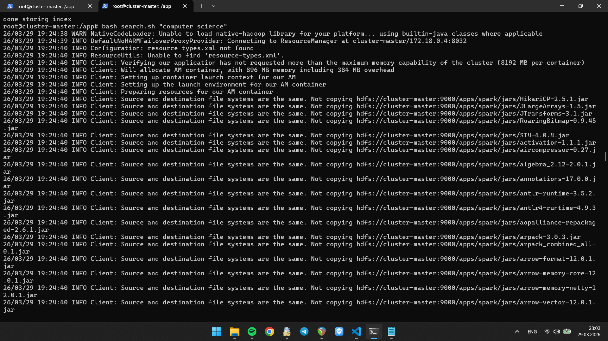
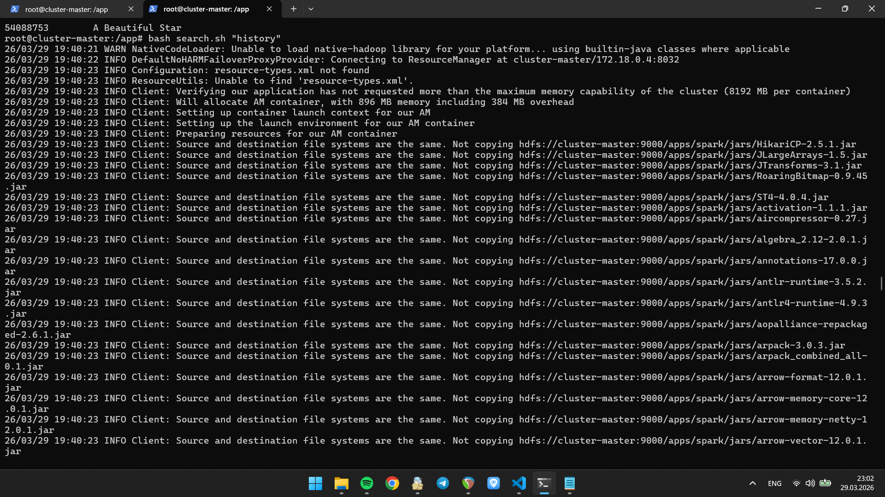

# Assignment 2 Report: Simple Search Engine using Hadoop MapReduce

Assignment link: https://firas-jolha.github.io/bigdata/html/bs/BS%20-%20Assignment%202%20-%20Simple%20Search%20Engine%20using%20Hadoop%20MapReduce.html

Name: Dinar Yakupov
Course: B23-DS-01

## Methodology

In this assignment, I built a small search engine by using Hadoop MapReduce, Cassandra, and PySpark together. The main goal was to take a Parquet dataset, turn it into text documents, build an inverted index, store the final index in Cassandra, and rank query results with BM25.

The dataset file used in my project is `a.parquet`, and I place it in `/app/a.parquet`. The main script is `app.sh`. When the project starts, this script starts Hadoop and YARN, creates the Python virtual environment, installs the needed packages, runs data preparation, builds the index, stores it in Cassandra, and runs two example queries.

For data preparation, I used `prepare_data.sh` and `prepare_data.py`. Spark reads the Parquet file and keeps the columns `id`, `title`, and `text`. After that, rows with missing values or empty text are removed. From the valid rows, the program keeps 1000 documents. Each document is written as a UTF-8 text file with the format `<doc_id>_<doc_title>.txt`. These files are uploaded to HDFS under `/data`.

After creating the text files, the same documents are converted into the format required for indexing. Each line becomes `<doc_id><tab><doc_title><tab><doc_text>`, and this output is written to HDFS under `/input/data` as one partition.

The indexing part is done by `create_index.sh` and the Hadoop Streaming scripts in `app/mapreduce`. In the first MapReduce pipeline, `mapper1.py` reads each document, tokenizes the text, and counts term frequency inside the document. Then `reducer1.py` groups records by term and creates the main posting data and vocabulary data. In the second pipeline, `mapper2.py` and `reducer2.py` calculate corpus statistics such as total number of documents and average document length. These values are needed later by BM25.

After the Hadoop jobs finish, the outputs are split into four final parts:

- vocabulary
- index
- documents
- stats

These files are stored in HDFS under `/indexer/vocabulary`, `/indexer/index`, `/indexer/documents`, and `/indexer/stats`.

For storage, I used `store_index.sh` and `app.py`. The program connects to the Cassandra container and creates the keyspace `search_engine`. Inside this keyspace, the project stores four tables: `vocabulary`, `postings`, `documents`, and `corpus_stats`. The vocabulary table stores document frequency for each term. The postings table stores term frequency and document information. The documents table stores document title and length. The corpus stats table stores values like `total_docs` and `avg_doc_length`.

For search, I used `search.sh` and `query.py`. The query text is passed to `search.sh` as a user argument, and the script forwards it to `query.py` through stdin. Then `query.py` tokenizes the text with the same regular expression used during indexing. After that, the program reads the needed rows from Cassandra and calculates BM25 scores with PySpark. The BM25 formula uses term frequency, document frequency, document length, and average document length. After scoring, the top 10 results are printed in the format `doc_id<TAB>title`.

The search script runs on YARN in cluster mode. This was useful for me because it showed how the search step can also run as a distributed job, not only the indexing step.

For the optional task, I added `add_to_index.sh`. This script takes one local text file, uploads it to HDFS `/data`, rebuilds `/input/data`, reruns the indexing steps, and updates the Cassandra tables. Because of that, the search engine can include a new file after the first index has already been created.

## Demonstration

To run the repository, I use:

```bash
git lfs pull
docker compose up
```

I need `git lfs pull` first because the large `a.parquet` file is stored with Git LFS.

The automatic flow is:

1. start Hadoop and YARN
2. create `.venv`
3. install packages from `requirements.txt`
4. run `prepare_data.sh`
5. run `index.sh`
6. run `search.sh "computer science"`
7. run `search.sh "history"`

For manual checking after startup, I used commands like these:

```bash
docker exec -it cluster-master bash
cd /app
hdfs dfs -ls /data
hdfs dfs -ls /input/data
hdfs dfs -ls /indexer
hdfs dfs -text /indexer/stats/part-*
bash search.sh "computer science"
bash search.sh "history"
```

The `search.sh` script takes the query as an argument, then sends it to `query.py` through stdin.

I also checked Cassandra with:

```bash
docker exec -it cassandra-server cqlsh -e "DESCRIBE KEYSPACE search_engine;"
docker exec -it cassandra-server cqlsh -e "SELECT * FROM search_engine.corpus_stats;"
```

In the successful run, the project created `/data`, `/input/data`, and `/indexer` in HDFS, and Cassandra stored the final index tables. The corpus statistics showed `total_docs = 1000` and `avg_doc_length = 575.759`, so the indexing step finished correctly.

For testing the search engine, I used the queries `computer science` and `history`. The query `history` gave more clearly related results. Some of the returned titles were:

- `A Brief History of Time`
- `A Briefer History of Time`
- `A Brief History of Everyone Who Ever Lived`

The query `computer science` also returned valid results, but they were not as clearly related as the `history` query. My understanding is that this happens because the tokenizer is basic and the ranker only uses the information stored in the index, so the result quality depends a lot on the words that appear in the dataset.

For the optional task, a new text file can be added with:

```bash
docker exec -it cluster-master bash
cd /app
bash add_to_index.sh /app/my_new_document.txt
```

This command adds the file into the existing pipeline, rebuilds the input for indexing, and updates the Cassandra data.

I also tested the optional task with a file called `Optional Added Document`. After running `add_to_index.sh`, the Cassandra statistics changed from `total_docs = 1000` to `total_docs = 1001`, so the new file was included in the index.

The following screenshots are from my successful runs:


This screenshot shows the terminal after the index was created successfully. It includes the `/indexer` folders and the final corpus statistics stored in Cassandra.



This screenshot shows a successful query run for `computer science` with the returned document ids and titles.



This screenshot shows a successful query run for `history` with the ranked results.

Since I am still learning big data tools, this assignment helped me understand how the pieces connect in one full workflow. Before this, I mostly understood Hadoop, Spark, and Cassandra separately. In this project, I got more practice with how data moves from preparation, to indexing, to storage, and finally to query-time ranking.
